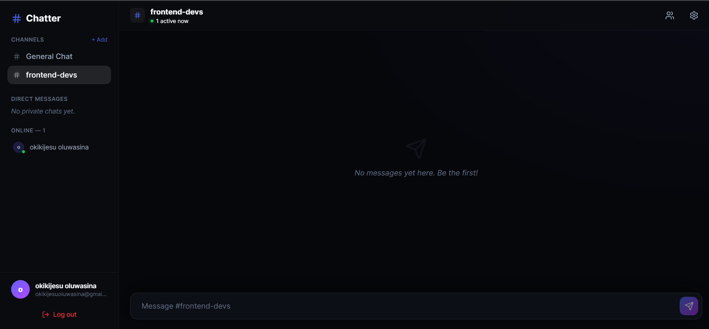

# Chatter - Premium Real-time Web Chat

### 🔗 **[Live Demo](https://chat-me-tau-rosy.vercel.app/)** | 🚀 **Portfolio Showcase**

Chatter is a high-performance, real-time chat application built to demonstrate advanced frontend engineering capabilities. Designed from the ground up to solve complex UI/UX challenges, this project highlights expertise in core modern web development paradigms.

---

## 🖼 Screenshots

### Landing Page

### Live Chat Interface

---

## 🚀 Live Link

[https://chat-me-tau-rosy.vercel.app/](https://chat-me-tau-rosy.vercel.app/)

---

## 🛠 Tech Stack

- **Framework**: Next.js 15+ (App Router, Edge Middleware)
- **Database/Auth**: Supabase (PostgreSQL, Auth, Realtime)
- **Styling**: Tailwind CSS v4 (Custom Tokens, Glassmorphism)
- **State Management**: React (`useState`, `useEffect`, `useRef`) + Supabase Subscriptions
- **Testing**: Vitest & React Testing Library (Unit and Component Testing)
- **Performance**: `react-virtuoso` (List Virtualization), React.memo
- **Utilities**: `lucide-react` (Icons), `date-fns` (Time formatting), `clsx`/`tailwind-merge` (Dynamic styling)

---

## 📚 What I Learned

During the development of Chatter, I deepened my expertise in:

1. **Real-time Data Syncing**: Implementing sub-millisecond bidirectional communication via WebSockets using Supabase Channels.
2. **Frontend Performance Optimization**: Solving browser lag and massive DOM payload issues by integrating `react-virtuoso` for virtualized lists, allowing the app to render thousands of messages effortlessly, and strategically applying `React.memo` to eliminate unnecessary DOM re-renders.
3. **Advanced State Management**: Orchestrating complex state between dynamic UI components—such as auto-scrolling behaviors, debounced typing indicators, and optimistic message delivery.
4. **Testing Architectures**: Setting up Vitest and React Testing Library from scratch to enforce reliability over complex tailwind-merging logic, dynamic class generation, and component behavior.
5. **Database Architecture**: Safely scaling relational databases by utilizing Composite SQL Indexes on large tables (e.g., `(room_id, created_at)`) drastically speeding up historic chat fetches.

---

## ⚠ Challenges Faced

- **Refactoring for Modularity**: The initial component architecture became unwieldy as features were added. We successfully refactored a massive monolothic page into tightly encapsulated sub-components (`ChatHeader`, `MessageList`, `RoomPanels`, `ChatSidebar`), which required careful prop-drilling and state orchestration using React hooks.
- **Handling Large Data Rendering**: Loading thousands of text nodes caused immediate browser stuttering. This challenge was resolved by refactoring the `MessageList` component to utilize "windowing" (rendering only the visible elements in the DOM) replacing default mapping behavior.
- **Security implementation against XSS**: We had to be extremely strict about sanitization. Ensuring user-generated content was both expressive but entirely stripped of un-safe DOM scripts using `DOMPurify` before rendering was critical. 
- **Tailwind CSS Conflict Resolution**: With dynamic variables and conditional styling in modern React, Tailwind classes often conflict (e.g., `px-4 px-2`). Creating a solid utility integration with `tailwind-merge` and `clsx` was crucial for reliable styling behavior.

---

## 📈 Future Improvements

- **End-to-End Testing Environment**: Setup Playwright or Cypress to automate full-browser authentication and messaging workflows tests.
- **Media Attachments**: Expand the Supabase bucket policies and UI to support dragging and dropping images, videos, and files into the chat context.
- **Message Editing and Deletion**: Enhance the `MessageItem` component to handle Context Menus that allow the sender to modify or redact their history.
- **Global Search Functionality**: Add a backend text-search vector allowing users to quickly query and jump-to historical messages across all channels.
- **Push Notifications**: Integrate web push features to notify offline users of DMs or mentions.

---

## 🚦 Local Setup

1. Clone the repository.
2. Run `npm install`.
3. Create a `.env.local` containing your `NEXT_PUBLIC_SUPABASE_URL` and `NEXT_PUBLIC_SUPABASE_ANON_KEY`.
4. Run the SQL schema found in `supabase/schema.sql` against your Supabase project.
5. Run `npm run dev`.
